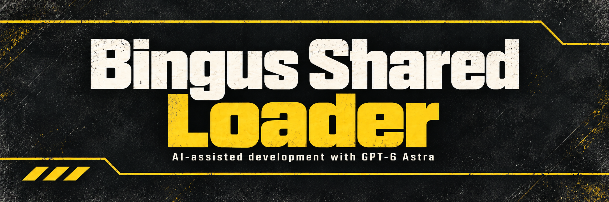

> Supports Steam build 25480438 / EXE 1.8.46015.0. Tested in recorded real play aboard the ship and in a mission.

# Bingus Shared Loader

> [!IMPORTANT]
> **Required dependency for Armory Preview Cache, Know Your Constellation, Controllable Hover Pack, Vehicle Stability, Enemy Collision Synchronized, Vanilla Plus Megapack or the separate Better Stratagem Bounce, Hellpod Steering Unlocked, Reinforcement Beacons Fixed, Consistent Vaulting, Shallow Water Diving and Sentry Aim Retention mods.** Install with **Arsenal or HD2MM**: import `Bingus-Shared-Loader-v18.zip`, enable it alongside the megapack or your chosen mods, then click **Deploy**. One loader installation supports all your selected mods.
>
> **Arsenal (default priority): place Bingus Shared Loader LAST, at the bottom of the load order**, then **Purge / Deploy**. If you enabled first-mod priority, place the loader first instead.

**v18 / API 1** raises the limits of the game's shared LuaJIT code cache, so busy missions no longer throw away every mod's compiled code (see [below](#shared-luajit-code-cache)). It keeps automatic discovery for declared addon entries, all existing module registrations and shared logging. In recorded real play the cache never flushed while the game and mods used 960 KB of machine code, nearly twice the old limit. See [mod author instructions](docs/AUTHORING.md). Current standalone copies may remain installed alongside the pack. shared resource identities and per-mod guards prevent duplicate initialization. The loader remains a separate package.

Starts your installed CowboyBingus mods and supported third-party mods together. The loader has no gameplay effect by itself.

**Install:** Close Helldivers 2. Import `Bingus-Shared-Loader-v18.zip` and your chosen gameplay ZIPs into **HDArsenal** or **HD2MM**, enable them, and deploy. Keep the loader enabled while any dependent mod is enabled.

This is **v18 / API 1**, a required update for every CowboyBingus mod. Replace the previous loader entry, then **Purge / Deploy**. The manager GUID and runtime API marker are unchanged, so existing module-only gameplay packages remain compatible. Do not install old and new loader copies together. See [installation](INSTALL.txt). The preceding loader was confirmed working with Know Your Constellation. This release retains that registration and its API.

## Shared LuaJIT code cache

Helldivers 2 runs every Lua mod in the game's own LuaJIT 2.1.0-alpha, which keeps its 2015 limits: 512 KB of compiled machine code and 1,000 traces, shared by the game and all mods. When either fills up, LuaJIT discards all compiled code at once and recompiles it during play. Before any mod starts, the loader raises the limits to 16 MB and 8,000 traces. If a flush still happens, it doubles them, up to 64 MB and 16,000 traces. Traces only grow while the Lua heap is under 24 MB, because this LuaJIT keeps its heap in scarce memory below 2 GB. This adds no work to any frame.

The loader log shows one line such as `LuaJIT cache: expanded 16384 KB / 8000 traces; flushes 0, growth 0; watcher on`.

## Supported modules

- Armory Preview Cache, for retained equipment thumbnails, asset preloading and learned startup preparation in Armory and mission briefing.

- Vanilla Plus Megapack, including the CowboyBingus gameplay modules below.
- Better Stratagem Bounce.
- Hellpod Steering Unlocked.
- Reinforcement Beacons Fixed, formerly Reinforcement Beacon Fix.
- Consistent Vaulting, for local manual-vault candidate processing.
- Shallow Water Diving, for local airborne water-reference handling.
- Sentry Aim Retention, for experimental autonomous-sentry target-loss handling.
- Enemy Collision Synchronized, for compatible large enemy corpses across all three factions.
- Know Your Constellation, for local enemy forecasts on mission previews and briefing.
- Controllable Hover Pack, for manual hover cutoff with native landing assistance using the Jump Pack control (default Space).
- Vehicle Stability, for experimental local-driver yaw assistance on the Bastion and gunner FRV.
- HUD Ballistic Trajectory Overlay **v2**, released September 11, 2026.
- The reserved Wide Angle Stratagems module, if separately installed.

Each gameplay package owns its own Lua resource and is optional. A missing or failed module does not prevent later modules from loading. A registered name does not mean a release exists or establish that module's gameplay compatibility.

The loader owns `core/wwise/lua/wwise_flow_callbacks`, preserves the original audio callbacks and leaves `boot` unchanged. HUD+ **0.1.3** can coexist through its existing startup script. the loader does not start HUD+ a second time.

## HUD Ballistic Trajectory Overlay v2

Install the original overlay separately and give **Bingus Shared Loader the winning priority over the overlay** in your manager, then Purge and Deploy. Arsenal still reports their shared startup file as a conflict. this overlap is expected for the supported pair. The loader starts the installed overlay automatically. No extra compatibility mod is required, and other gameplay mods are optional.

The overlay keeps its own configuration and defaults. Its optional `HUDBTO.ini` belongs beside the game's `bin` and `data` folders, as directed by the original package. The loader neither changes nor installs that file.

The maintainer confirmed v3 works in-game with the v2 overlay linked in [technical notes](docs/TECHNICAL.md). Offline checks also cover startup, configuration reads and callback forwarding with HUD+ and the gameplay modules. Future releases need revalidation if their startup changes. Other startup replacements can still conflict. this loader does not merge arbitrary scripts.

Supported: Steam build **25480438** / EXE **1.8.46015.0**. Callback preservation, missing-module behavior and manager deployment are checked independently of each gameplay mod's behavior.

Loader v14 creates `%LOCALAPPDATA%/CowboyBingus/Helldivers2/Logs` for its own log and all updated CowboyBingus mod logs. Each mod retains its existing filename.

## Source

- `src/`: the shared coordinator.
- `tests/`: callback, package and optional HUD compatibility checks.
- `scripts/`: build, strict packaging and optional Arsenal validation.
- `assets/`: banner and square Arsenal artwork.

[Build instructions](CONTRIBUTING.md) | [Technical notes](docs/TECHNICAL.md) | [Third-party inputs](THIRD_PARTY.md) | [Release notes](docs/RELEASE_NOTES.md)

**AI disclosure:** GPT-6 Astra assisted with research, implementation, debugging, documentation and artwork.

Current version: **v18**, for game build **25480438**. See [changes](CHANGELOG.md) and [validation coverage](docs/MIGRATION_VALIDATION.md).
